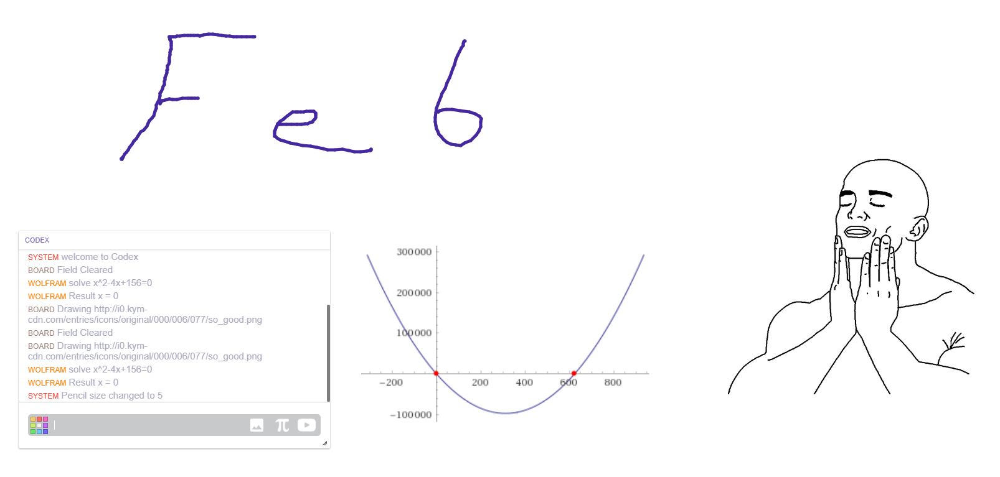

# Feb
> Draw, chat, learn, and listen to music with friends. Developed on socket.io

## Release History
* 1.0.1
* 0.9.8
    
        
## Todo
- [x] History
- [x] Images
- [x] Todo
- [x] Wolfram
- [x] Youtube
- [ ] Mobile support

## Meta

Temo Jr. Tchanu – [@Tchanu](https://linkedin.com/in/tchanu/) – Tchanukvadze@gmail.com

Distributed under the MIT license. See ``LICENSE`` for more information.

[https://github.com/Tchanu](https://github.com/Tchanu)

## Contributing

1. Fork it (<https://github.com/Tchanu/socket-chat/fork>)
2. Create your feature branch (`git checkout -b feature/fooBar`)
3. Commit your changes (`git commit -am 'Add some fooBar'`)
4. Push to the branch (`git push origin feature/fooBar`)
5. Create a new Pull Request

<!-- Markdown link & img dfn's -->
[npm-image]: https://img.shields.io/npm/v/datadog-metrics.svg?style=flat-square
[npm-url]: https://npmjs.org/package/datadog-metrics
[npm-downloads]: https://img.shields.io/npm/dm/datadog-metrics.svg?style=flat-square
[travis-image]: https://img.shields.io/travis/dbader/node-datadog-metrics/master.svg?style=flat-square
[travis-url]: https://travis-ci.org/dbader/node-datadog-metrics
[wiki]: https://github.com/yourname/yourproject/wiki
